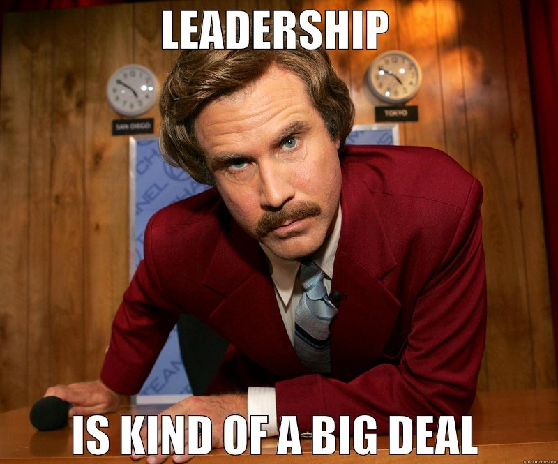
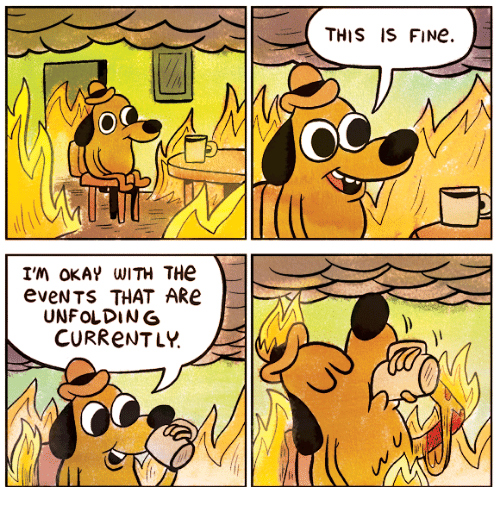
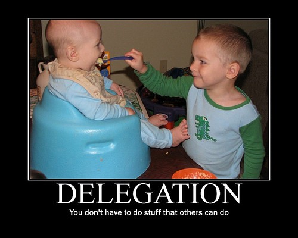

Hey Mentees!

Originally this was going to be a weekly series but as you know I have not been to well over the past few weeks but I’m on the road to a full recovery!

If I’m correct, this may be the week where you will be assigned into different groups and told to build something. When it was our time, we weren't given too much tips or direction by the coaches & later I found that it was some kind of sick social experiment to improve our group working abilities. 🤨

We managed to build a good working product with a lot of features compared to other groups but it was by no means a successful project in my personal opinion.

I want to go through some of the things that went wrong so you can identify this at the very start.

---

### 1) We Had No Team Leader!

We got together with our group and we didn’t think about choosing a leader. When pair programming, you don’t need it but when you have 5 people in a group, it becomes a necessity.   
Because nobody was selected to be a leader, everybody felt like it wasn’t in their place to lead. This lead to a cascade of bad things that I will touch up on.

The team didn’t feel cohesive, there was panic when the deadlines came in and there was a whole heap of confusion. Nobody felt it was _their role_ to keep everything together at an acceptable rate of togetherness and it was bad. **Don’t make this mistake.**

### 2) Picked a Tech That 2/5 Of Us Knew

This isn’t a bad thing in itself but when the 2/5 of us didn’t feel to be in a leadership or mentorship role to the other group, the **gaps in knowledge increase exponentially**.   
We were so focused on getting our project ironed out, we never really saw it as a learning exercise. It means we didn’t put the effort in to help everybody else get up to speed. We could have easily taken a whole day or 2 to get everybody on the same page but we let the time pressure get to us and focused on result instead of process.

**Thinking like this on a long term basis will just lead to a toxic environment where people don’t feel fully included in the group.**

### **3) Panic!**

Panic set in. We tried to tell everybody we will have a product, everything will be fine but _nobody felt fine_. They were using a tech stack they hardly knew and time was ticking. Heart-rates were hitting triple digits. Coffee was brewed continuously. Chicken Katsu wraps left cold and uneaten.

Having a leader would make sure this panic doesn’t set in. Everybody would have been calm and collected.

### **4) Zero Task Delegation!**

Those of us who knew the stack, didn’t take leadership. What we should have done was **break up the app into little and big tasks** and asked people to nominate themselves to pick one and work on it as a pair with someone else if needs be.   
That would have taken the workload of ourselves and have everybody feel involved and included. We would have had a better working group, the process would have been sound and the happiness of each group member would have risen.

> **It’s not always about getting the task done by any means necessary, its about getting the right process so any task put your way can get completed with everybody leaving with some kind of satisfaction in regards to their contribution.**

In this way **although we had a project that worked and progressed the most out of the other groups, we failed our team members.**

**I really recommend a web-app called** [**Trello**](http://www.trello.com) where you can set tasks and delegate them as everybody sees fit. That way, you can keep progress on your project on a whole in an open way. You will use it for later group projects so it will be a good idea to check it out early!

---

Although this article sounds a bit doom and gloom, we had a good time working and exploring new technology.

([http://dreamstay.herokuapp.com](http://dreamstay.herokuapp.com/)) -> AirBNB Clone made in a week.

We observed all these kind of things in our retro sessions and I felt **it would be a great idea to share our lessons from experience so you can avoid these pitfalls and improve your teamwork/leadership skills!**

#### The mistakes made this time round lead us to greatly improve these skill the next time round!
