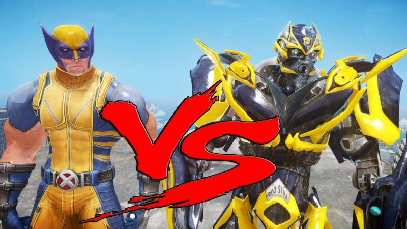

One of the first thing I remember about learning javascript was the fact that that I’d too often get some kind of return that I did not want. Often it was ‘undefined’. This was a reason why in the past I had avoided using array methods & opted for migrain inducing nested loops.

Recently I read a medium article where the premise was that we rarely needed to use for-loops when working with arrays. A reel of flashbacks played back in my mind. ‘undefined’ in the console.log. Terrifying.   
How could someone just willingly subject themselves to array method sadomachism?

Something in the smaller, more reasonable region of my brain clicked. These people were not wrong at all. It was my understanding of Array methods in javascript that was flunky and led me to avoid using them when I could in the past.

In this article I want to go over the two types of things array methods usually do to data.

### Array Mutation Methods

Array Mutation methods are methods that mutate or change the original array. Alot of what we want to do with arrays can be boiled down to either adding, removing and replacing items. There are many ways to skin a kata.

Lets look at some examples.

As we can see above, push is a mutation method. It can only mutate the original array it is called on. When we tried to return a new transformation to the arrClone variable, we find out that that behaviour is not available using this method.

How can we add an element to an array while at the same time returning a new transformed array?

In this instance we can use the .concat() method

This way, you avoid mutating the original array and always return a new one. You can follow what is happening to the data at what steps when you utilize transformer type array functions.

Let’s look at the .reverse() function.

Looking at the two gist above, did you realise that .pop() is returning something other than what we might have expected? (The element that would have been popped off the end of the array). How is it then a mutation array method when it returns back something entirely brand new?  
   
That is something that can get confusing about array methods, some can be both at the same time in a strange way…

.pop() returns a new value which is the last element in the array, but at the same time it also mutates the original array.

When you don’t know what these methods specifically do or return, using array methods can get confusing and data can get transformed by accident or you are left with undefined returns in your functions. Sitting for hours looking for array method bugs isn’t the best use of time.

### Array Transformation Methods

One school of thought I have been reading alot is to avoid mutating data as much as possible with array methods _(When you can, its not a strict do or die rule)_.

Using transformer array methods returns a transformed array & that means that you have a bit more control. Your returns become predictable and the original input data remains untouched.

These methods come in the form of .map, .filter, .reduce .concat etc. You can find a list of these on the [Mozilla MDN documentation](https://developer.mozilla.org/en-US/docs/Web/JavaScript/Reference/Global_Objects/Array#Array_generic_methods) about Array methods. They called them Mutators and Accessors and iterators but I think my names for them are way cooler.

Imagine we had an array of a football team (manUTD) . Lets say I want to tell my new function I’ve created that I want to remove players who didnt play every match and return just the ones who did.

If we mutated our original input array of the team, soon enough we will barely have a football team. How much mutation can manUTD take? What if another function needed manUTD to be intact to operate correctly and accurately?

We can use transformative array functions to ensure the original input remains intact and the output is not the input, it is a new variable that contains transformation of it.

Heres our reduced for readability football team

Now here is our injured players list:

Lets create a function that takes the two arrays, and returns a brand new array that doesnt include any of the injured players. We will assign the transformed array to result and then return result.

Now look at the output

The good thing about this is you can also apply more functions to the return result or even chain them and still keep the original data non-mutated.   
No matter how circumstances change for what you want to return, the original input data remains unmutated.

That means you can run your function a hundred times and nothing will mess up. When mutating data, running a function with the same input twice in a row can have different outputs. That can make your codebase unpredictable if not careful and is a long night of bug fixing waiting to happen.

Knowing that some array functions change the input data, some return transformed data and some do both, will help you in the long run. Array methods vary in their behaviour so its always best to check before use in order to save yourself a headache!

One useful resource if you are not using it already is the [MDN Web Docs](https://developer.mozilla.org/en-US/docs/Web/JavaScript/Reference/Global_Objects/Array#Array_generic_methods)!

I hope this article was able to slightly demystify the reasons why different array methods don’t operate how one would expect them to! The best way to learn is to **do,** so make sure you experiment! Thanks for reading!
