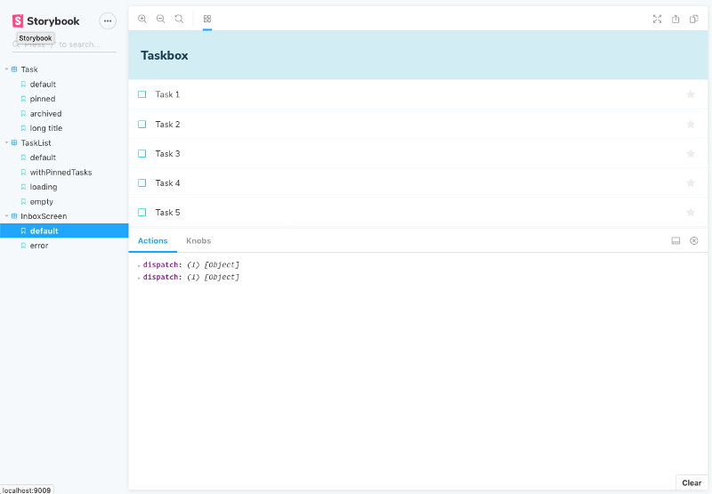
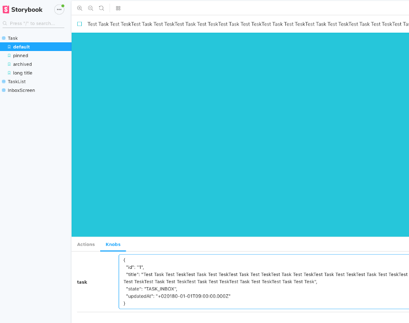
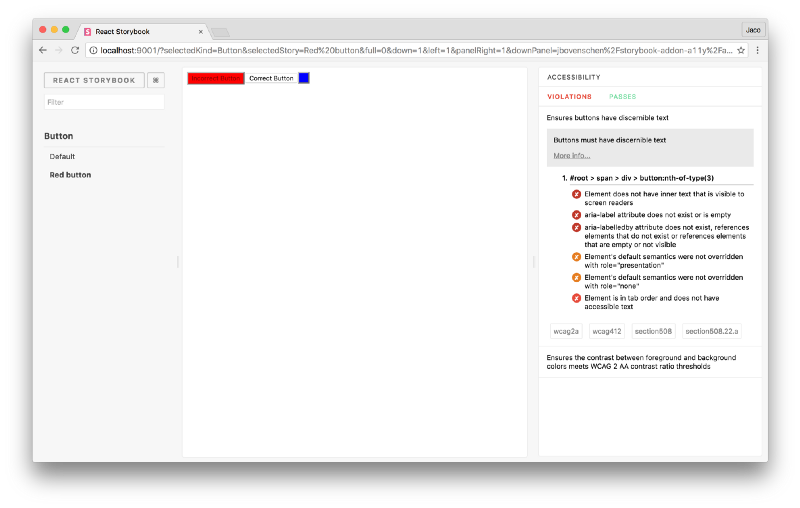

Recently I’ve been delving into component libraries in the context of medium & large corporations, inspired by the process of things at my workplace. I found that it is quite a feat to get a large umbrella business to follow one design direction so I am out to explore the paths as to how they do this.

---

### Problems I’ve noticed

So recently I’ve been delving into component libraries in the context of medium & large corporations inspired by the process of things at my workplace. I think it’s quite the feat to get a large umbrella business to follow one design direction so I am out to explore the paths as to how they do this.

How do we get different sectors of a large company to stop recreating common components & get them to buy into a shared component library?

When it comes to creating visual components then trying to accommodate for the wide-ranging use-cases and contexts, I can imagine the problems roll in quickly.

Imagine. You, the CEO of some-booming-tech-company, watching your tech business take off before your very eyes. Your tech team wants to put together an official component library. The problems start.

Your designers want to contribute to the process of breathing life into their designs but they are blocked behind bland and overly technical documentation. Mini novels & no visuals insight.  
Your designers speak a different language to your developers. To them, CTRL+R doesn’t redo the line in VIM, no. It toggles the rulers in Sketch.

Your Product Owner’s and testers want to see changes too & maybe have a little fiddle.

Miscommunication and resentment brew just because the component library isn’t easy to access. Your team becomes unhappy and demotivated. You end up bankrupt because you didn’t mind your team’s happiness. Nowadays you survive in life by hopping from tech meetup to tech meetup, living off of free beer and pizza.

**Ok, a bit drastic but you catch my drift**

The big gaps in the feedback loop lend itself to communication issues between teams. In various contexts, it isn’t easy to instantaneously showcase a work-in-progress, especially when it needs to be seen in a specific context.

### So WTF is Storybook.js?

Storybook is an interactive development playground for creating visual components.   
It’s a living breathing visual component documentation that makes building and showcasing interface components easier than before.  
Storybook makes component library visual. Click on it, drag things about, type things in, all of what should be easy is now possible.   
It allows you to interact with and experience components like a regular human being. Like the user.

Once built and set up, it exists as a simple link that anyone can go to, choose a component and play around with it.

---

### How does this help non-coders in my team?

As a developer, you can set up ‘playgrounds’ to test components as small units and also check how well they work visually and functionally in unison with other components.

You can lay out the storybook how you want, even putting lots of components together to see how they compare against each other

 has laid out their pill states using Storybook 💊](./asset-2.png)

---

### How does this help non-coders in my team?

One of the great things about storybook is as a stakeholder, product owner, designer, UX researcher etc. you can just access the link where storybook is hosted and easily interact and mess around with the component you want.

As developers, we can set up the states & contexts directly in storybook so whoever can just have a look and interact inside the playground. This means you wont have to send other members long winded instructions in order to get to that specific state unless needed. We can mock up integrations and present them to our team members.

This is excellent as it means people other than engineers can share their testing comments, questions & feedback with us much more easily, ultimately improving the team communication process, creating a more inclusive culture and a swiftly improving product.

Being able to collaborate and share work throughout the organisation without technical hiccups sounds like something that should be a given but sadly it’s not!

---

### Addons

One of the 🔥 things about storybook is the addons. One of the important ones that will help is called **Knobs.**

The knobs addon allows you to dynamically modify props on the fly. You can test if copy content works with a certain component or not. How would input of different languages work with the component? Many other things that the developers may have not forseen. Any other prop can be modified if set to allow for this.

It really opens up the ballpark and allows people other than developers to really mess around and I feel it can really increase the collaboration and communication inbetween those who fit in product teams.

Another is the a11y addon which gives you real time accessibility-violations on your components!

[Check out all the useful development addons in StoryBook](https://github.com/storybookjs/storybook#addons)

---

### But we already have dedicated testers

Just because we have dedicated testers shouldn’t mean we just leave all testing to them! Ideally, we should look at it as a mindset we adopt throughout the whole development cycle.

So many simple bugs can be uprooted by prodding at things a bit more. With Storybook in a way are able partly to democratize this. Designers, Product Owners & Stakeholders should be able to highlight and point out potential problems earlier in the cycle.

Let’s say we were creating some type of component.   
In Storybook, we can easily test how the component deals with text that is 5 to 1000 characters long, just by anybody being able to enter some text in the component.   
We can see how we handle text truncation in different viewports all without the component making it to production.   
Most importantly, we are seeing how these edge cases are represented visually as a passing unit test sometimes doesn’t tell the whole story.

---

### Another Tool I Have To Learn?

Not neccessarily. Tools are as useful as their usecases and I think that storybook very much suits companies with a growing component libraries that is used across the organization. I think if you have come across the problem of sharing and displaying components to a wider company, its worth looking into. There are probably a big number of usecases, but this one jumps out to me the most.

Anybody who wants to focus more on UI/UX development, I think its a tool you may come across in use at more and more big companies in the future!

---

Thanks for reading! If you liked this article then **subscribe to my mailing list**! I talk about getting into front-end engineering as a career & how people are using it as a hustle!
