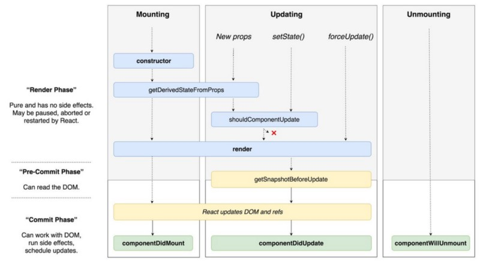

When I first started using React for my super basic apps, I had no reason to learn this.   
As time went on, I needed better solutions to the problems I faced.

#### What is the Component Lifecycle?

It’s basically a series of events that happens from the birth of our react component, to its eventual death ⚰️ (When its removed from the DOM).   
In a component’s lifecycle it will call a number of methods in a particular order.  
Having access to these methods as a developer allow you to override code at certain points in it’s life.   
Knowing this will help you tackle common challenges when developing your web apps!

### 3 Phases

Your react component will go through 3 phases in its life.

1.  **Mounting Phase**— The birth of your component. 👶🏾
2.  **Updating Phase **— The changes in your component. 🧒🏾
3.  **Unmounting Phase **— The death of your component. ☠️



The component has access to several different methods in its lifecycle that it will fire up in a specific order.

Did you know that some of these are called regardless, even if you didn’t know about them previously? The good thing is, you have access to them and can harness them when you need to.

---

### Initialization!

Hold on, why didnt I mention this earlier?   
I think for clarity sake we should breifly mention that the props and state are initialized before the other phases. I won’t go too much into this as I don’t think it needs much explaining!  
If you want an indepth read about this, check [here](https://developmentarc.gitbooks.io/react-indepth/content/life_cycle/birth/initialization_and_construction.html).

### **1) Mounting Phase**

When your component is first created and is being inserted in the DOM.

#### **constructor()**

This is the first method that gets called. Infact the constructor will be called before the component is even mounted.

You have likely seen something like this plenty of times in a react component.

```
constructor(props) {
    super(props)
    ...
}
```

It is used to initialise state in a component. It can also be used to bind event handlers to the component ([Although if you are using ES7 Babel, you wont need to do this](https://www.freecodecamp.org/news/the-best-way-to-bind-event-handlers-in-react-282db2cf1530/))

#### getDerivedStateFromProps()

```
getDerivedStateFromProps(props, state)
```

You can use this to update your components internal state with changes in props on thecondition of something. If we don’t need to make an update, we just return null. This would be the best way to update your state with incoming props!

This method runs on the initial mount and on every re-render afterwards.

**_Possible Use Case:_  
**Imagine you had an input component that checks if the user ID is changed from the previous userID and if so, it resets the email state.

```
class EmailInput extends Component {
  state = {
    email: this.props.defaultEmail,
    prevPropsUserID: this.props.userID
  };

static getDerivedStateFromProps (props, state) {
  // Any time the current user changes,
  // Reset the email part of the state!
  if (props.userID !== state.prevPropsUserID) {
    return {
      prevPropsUserID: props.userID,
      email: props.defaultEmail
    }
  }
  return null;
}
// ...
}
```

So as you can see, we have an if statement. If true, return an object that will represent your new local state, if false return null (equating in no change).

**_Cause For Concern:  
_**This lifecycle is called any time a parent component re-renders, regardless of whether the props are “different” from before. Because of this, it’s unsafe to _unconditionally_ override state using this lifecycle method. **Doing so can cause state updates to be lost! Gone! Destroyed!**


The official React docs say this method exists for rare use cases. In some situations, [you probably don’t need derived state](https://reactjs.org/blog/2018/06/07/you-probably-dont-need-derived-state.html) (read it!). It might be better to think about how your components are put together first.

You should also know that as this is a static function so it has no access to the`this` object. ([Huh lol?](https://developer.mozilla.org/en-US/docs/Web/JavaScript/Reference/Classes/static)😅)

#### render()

Did you know the common`render()` that we see all the time is also a part of the lifecycle? Infact it’s the only required lifecycle method in a react component.   
React takes our JSX and prepares to render it to the DOM. Even if you don’t want to render anything, you still need it (just make sure to return null).   
I’m assuming basic knowledge of react so I won’t get into this too much.

So after the render…

#### componentDidMount()

This lifecycle hook is ran once the component has mounted the DOM.

This is a good place to to do things that interact with the DOM since the component has now mounted at this point.   
(Try it before this and you may be trying to update elements in the DOM that don’t even exist yet!)

**_Possible Use Cases:_**

-   Setting isLoading states to become false now the component is mounted
-   Draw on the canvas
-   Add event listeners
-   Make API calls

Plus many other things you can think of.

Below is an example of making a simple get request in componentDidMount

```
class Example extends React.Component {
        componentDidMount() {
            fetch(url).then(results => {
                // Do something with the results that affect the DOM
            })
        }
    }
```

**_Cause For Concern:  
_**It triggers an extra rerender if setting state, but will happen before the browser updates the screen.   
As with all lifecycle methods, use this pattern with care as careless use can lead to performance issues!

---


### 2) Updating Phase

It’s good you made it this far. Let’s continue with the 2nd phase, the updating phase.

This starts when the component has been successfully mounted on the browser and is ready to recieve new updates. It can be updated by the component recieving new props or updating the current state (both triggering a re-render).

There are several methods that are called in this phase in a specific order.

#### static getDerivedStateFromProps()

Get’s called again! Does exactly the same thing as in the mounting phase

#### shouldComponentUpdate()

```
shouldComponentUpdate(nextProps, nextState)
```

The ball is in your court with this method. By default, this returns true but what about if you don’t want your component to update? A re-render might be costly and may trigger re-renders of children components so you may only want to trigger a re-render in certain circumstances, even if the props update. Not everyday re-render.

This component takes in two parameters, incoming props & an incoming state object.  
You can then use these in your code to compare them against your current props and state. if it meets your condition of choice, you can return true, this triggering an update. If false, no update.

**_Possible Use Case:_**

Imagine you have a List. containing a number of ListItems as components.  
You want to check whether an an item in the list (ListItem) is favourited already, and if it is, you want to avoid triggering a re-render as that also will trigger re-renders for any child components.   
(Because you care about web performance & people who still use internet explorer on old computers)

```
class ListItem extends Component {
  shouldComponentUpdate(nextProps, nextState) {
    return nextProps.isFavourite != this.props.isFavoourite;
  }
..
}
```

**_Cause For Concern:  
_**Currently, if `shouldComponentUpdate()` returns `false`, then `[UNSAFE_componentWillUpdate()](https://reactjs.org/docs/react-component.html#unsafe_componentwillupdate)`, `[render()](https://reactjs.org/docs/react-component.html#render)`, and `[componentDidUpdate()](https://reactjs.org/docs/react-component.html#componentdidupdate)` will not be invoked.

This method exists moreso for performance optimization purposes. If you feel you are using this method for more than that, you should maybe think if yoou are approaching the problem in the best way.  
You can consider using a [PureComponent](https://reactjs.org/docs/react-api.html#reactpurecomponent) instead. It does a shallow comparison of props and state, so its less likely to skip neccesary renders. It will save you having to code the logic.


#### render()

This gets called again. No explanation needed hopefully.

#### getSnapshotBeforeUpdate()

```
getSnapshotBeforeUpdate(prevProps, prevState)
```

This gets called between `render` the output is rendered but just before its output is attached to the DOM! Allowing you to quickly grab information from the DOM before your render changes the DOM.

It takes previous props & previous state as an argument and lets your component capture current values for eg. perhaps a scroll position before they are potentially changed.

**_Use Case:_**  
Imagine you are adding items to a long list but don’t want the users view focus to get lost as the items shifts the scroll position.   
We can use `getSnapshotBeforeUpdate()` to adjusting the scroll position so that the user’s viewpoint of wherever they are remains the same no matter how many items are added to the list.   
This way, the item you were looking at isn’t shifted downward to accomodate for new items.

```
class ScrollingList extends React.Component {
  constructor(props) {
    super(props);
    this.listRef = React.createRef();
  }

getSnapshotBeforeUpdate(prevProps, prevState) {
    // Are we adding new items to the list?
    // Capture the scroll position so we can adjust scroll later.

    if (prevProps.list.length < this.props.list.length) {
      const list = this.listRef.current;
      return list.scrollHeight - list.scrollTop;
    }

    return null;
  }

render() {
    return (
      <div ref={this.listRef}>{/* ...contents... */}</div>
    );
  }
}
```

You should return a value, or null. If the value returned isn’t null, it then gets passed into our next lifecycle method…

#### componentDidUpdate()

```
componentDidUpdate(prevProps, prevState, snapshot)
```

At this point, our changes have been committed to the DOM.   
In `componentDidUpdate` we have access to three parameters.

-   The previous props
-   The previous state
-   The snapshot (return value of `getSnapshotBeforeUpdate())`

Great if you noticed that we have access to the return value from the previous method `getSnapshotBeforeUpdate()`, now the parameter `snapshot`. We can use this value to do all sorts to change & manipulate the DOM after the component has been commited to it.

```
class ScrollList extends React.Component {
  constructor(props) {
    super(props);
    this.listRef = React.createRef();
  }

  getSnapshotBeforeUpdate(prevProps, prevState) {
    /* Are we adding new items to the list?
    If so, apture the scroll position so we can adjust scroll later.

    if (prevProps.list.length < this.props.list.length) {
      const list = this.listRef.current;
      return list.scrollHeight - list.scrollTop;
    }
    return null;
  }

  componentDidUpdate(prevProps, prevState, snapshot) {
    // If we have a snapshot value, we've just added new items.
    // Adjust scroll so these new items don't push the old ones out of view.
    // (snapshot here is the value returned from getSnapshotBeforeUpdate)
    if (snapshot !== null) {
      const list = this.listRef.current;
      list.scrollTop = list.scrollHeight - snapshot;
    }
  }

  render() {
    return (
      <div ref={this.listRef}>{/* ...contents... */}</div>
    );
  }
}
```

---

### 3) Unmounting Phase

The death of your component. Sad times. Before it dies, there is still one lifecycle method that will run .


#### componentWillUnmount()

```
componentWillUnmount()
```

This lifecycle method is invoked before the component is unmounted.   
This method is best used to do any cleanup for eg. cancelling active http requests, removing any event listeners, clearing up timers, even clearing up DOM elements.

Anything you don’t need persisting after the component is unmounted from the DOM.

```
componentWillUnmount(){
  clearInterval(this.interval)
}
```

**_Cause For Concern:_**  
You shouldn’t try and use setState in this lifecycle hook. Why? Because once the component is unmounted, it can never be remounted.   
That means its local state will be irrelevant. Once the component has been unmounted, that is it. Done. Finito. RIP.

---

### Overview

In Part 2, we will cover how the newer hooks API simplifies this and how we can implement some of these ina quicker more simple way. I much prefer using hooks where the usecases allows it.

Hopefully I’ve clearly provided some basic backround information in regards to the lifecycle methods in react.   
This should enlighten you about how we can use these to create solutions for the common problems we face in front end web development.

---

If you liked this article then **subscribe to my mailing list** below! I share my thoughts & learnings on various need-to-know Front-End engineering topics each month.

Thanks for reading! 👋🏾
