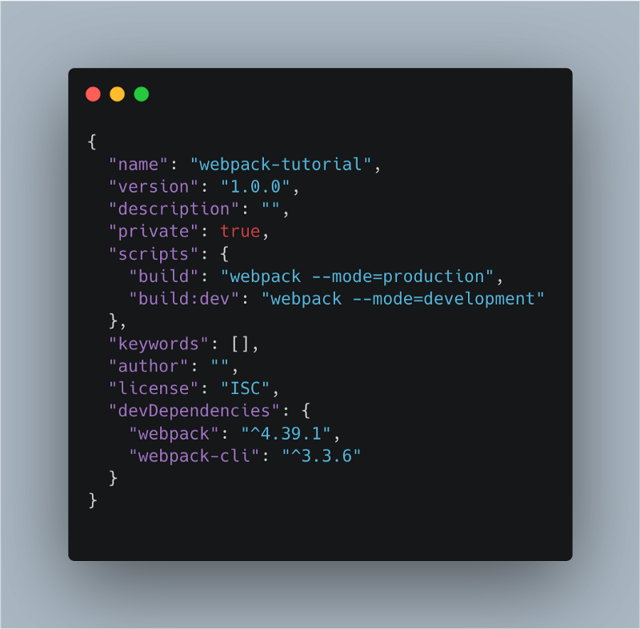
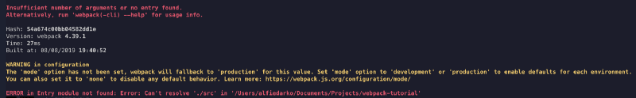
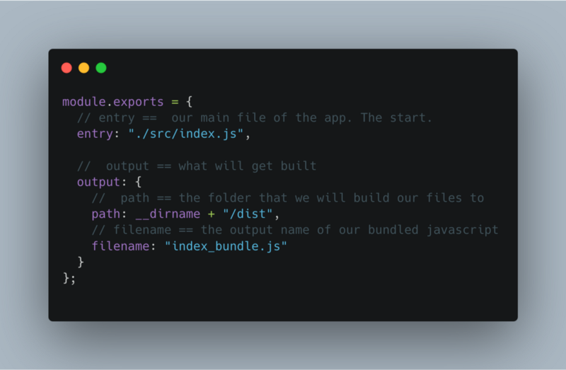
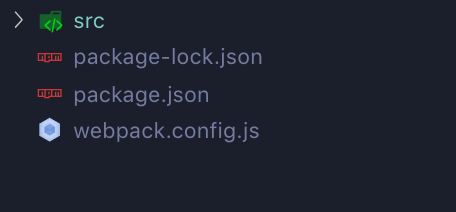
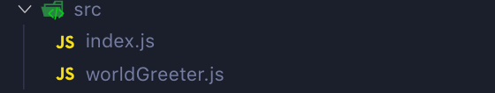
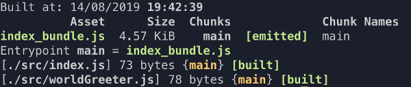
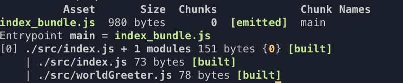

I will talk about the very basics of webpack, why on earth you should use it for and then we will setup webpack from scratch without using the CLI!

Hopefully by the end of this article, configuring webpack will be a peace of cake!

#### So..What is webpack then?

At its basis, Webpack is simply a module bundler. It bundles all JS modules into one JS file. It also packs your assets like CSS, images etc.

If we want, we can use webpack to do performance enhancement related things like optimize images, minify code (reducing code to its smallest denominator) and tree shaking(in a nutshell, removing dead code). This allows us to reduce the bandwith costs to our users and browsers, and should make our sites more faster and performant.


#### Why would we need to do this?

Cant we just use imports and requires and the other module implementations & benefit?

Well, if we are developing for the browser, its not so simple. The way we handle modules, imports and requires (and other attempts at modulising code) are quite inconsistent in the way the browser handles them and there are various gotchas like lack of async, lack of support etc..

Webpack handles everything and gives us one (or more) javascript file that has everything packed in for our use. We won’t ever need to think deeply about how to get our modulated code into the browser infront of all different types of users. It can also pack the asset files that we need too so they can be included in the output.

#### Lets see this in action.

The best way to illustrate this is to show you so get ready to open up your terminal.

We will make a super basic site with javascript, SASS (Which webpack will convert to CSS) and some images.  
I will show you how webpack outputs our files from many JS files packed into one.

---

First, we will make a directory (`mkdir`) called `webpack-tutorial` and then we will change directory into it (`cd`) by using the commands below.

`mkdir webpack-tutorial  
 cd webpack-tutorial`

Now lets quickly initiate a package.json file in that folder so that we can install npm plugins in our project. We will add the (`-y`) flag, so we can do a quick initiation, without it asking you too many questions.

`npm init -y`

When you have finished initiating your package.json, lets install webpack and the webpack-cli (webpack command-line interface )as dev dependencies

`npm i -D webpack webpack-cli`

Ok. Now its installed. We can webpack shit now right? Not so fast lol. We have to create a way that allows us to run our packed up javascript files when we need to.   
Lets create a script in the package.json that will allow us to do `npm run build` from the terminal.

Replace the script object in your `package.json` file with this:

```
"scripts": {
  "build": "webpack --mode=production",
  "build:dev": "webpack --mode=development"
}
```

Your package.json file should look something like below:



That allows us to run webpack whenever we run the build script.

If we run any of the build scripts right now, we will get an error! Let’s have a look at what happens.



The major things are the red error lines.

It’s saying that it cant find an entry! & It also needs a mode.

For Webpack to make the bundle. It enters a file at a certain point and creates a map or tree of what file is connected to what. In Webpack’s technical terms, it’s building a ‘**_dependency graph_**’. This is why we need an entry (It’s useful to know that we are not limited to one entry too!)

Webpack can use two different modes. Development & Production. Development assumes you are still developing the file so it wont optimize your bundle file. That means it wont minify your code allowing you to debug it easier than the spheghetti like

We can set both of these things in the Webpack Config aka webpack.config.js aka wth is this. Lets demistify what this is and set everything up!.

### **The Webpack Config**

This is the file that holds all your webpack configuration options. You actually don’t have to use this if you want just the basic default options. You also must have your entry file placed in a src folder like so `.src/index.js` .  
As a professional developer, its always beneficial to know how to configure the tools we use to our liking.

Lets create a `webpack.config.js` in your root folder. Alternatively you can do it with your terminal by entering `touch webpack.config.js`


Lets edit our webpack.config.js. Paste the below inside it.

```
module.exports = {
  entry: "./src/index.js",
  output: {
    path: __dirname + "/dist",
    filename: "index_bundle.js"
  }
};
```

Lets quickly run through the properties.

#### entry:

This is the start of our app. As said before, webpack will create a dependency graph, by mapping out what files depend on what. This can be more than a single file by using an array.

#### output:

This object holds properties that are to do with the files that webpack spits out. There are many properties that can go here but lets focus on 2 basics.

#### output.path:

The path property. This property is to tell webpack what folder we want to bundle our files to.

#### filename.path:

This property sets the name our bundled javascript file/s.



See, in this form it doesn’t look to complicated right? Lets move on to the last part of this article & tutorial.

### What about the entry and mode?

Remember when we tried to run webpack, it gave us an error talking about the entry and mode? We are going to sort that out right now.

Let’s create a src folder at the root level of our project.



and inside we want 2 files. `index.js` and `worldGreeter.js`.

The code for both is below.

```
// index.js

import worldGreeter from "./worldGreeter";

console.log(worldGreeter('wagwan'));

// worldGreeter.js

const worldGreeter = greeting => {
  return `${greeting}, you good yh?`
}

export default worldGreeter;
```

All it does is call `worldGreeter()` with a greeting of choice and returns back a string that is logged to the console. Nothing major.

Now lets run the development script first so run `npm run build:dev`


It creates a foolder called dist and a file called `index_bundle.js` (both as described in your webpack.config file) . The index\_bundle is both of your javascript files packed into one, and it will work as normal!

If you run `npm run build` webpack will generate the optimized file for production. Just look at the below images to see a comparison in filesize.



I’ll leave you with a little task. Have a look at the index\_bundle.js files after the production and development build scripts and compare the both of them. It will be evident as to why these files can be the same but have totally different filesizes.

There is alot more to webpack than this for eg. What about HTML, CSS, SASS, SVGs, images etc.?. I will be covering some of the more advanced features in my next articles but for now, this should be enough for you to understand what webpack does in a nutshell.

Thanks for reading and feel free to follow me on here and on Twitter / Instagram @AlfonzoMillions for more content!

---

If you liked this article then **subscribe to my mailing list**! I share my thoughts & learnings on various need-to-know Front-End engineering topics each month.
